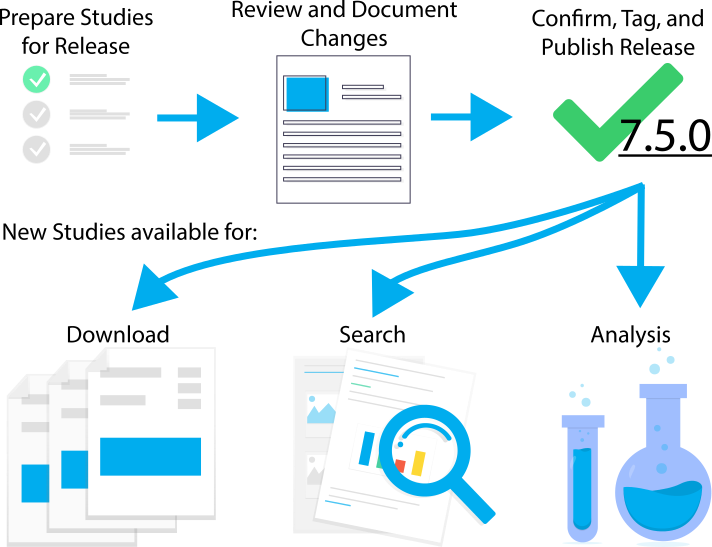
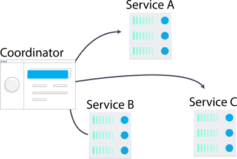
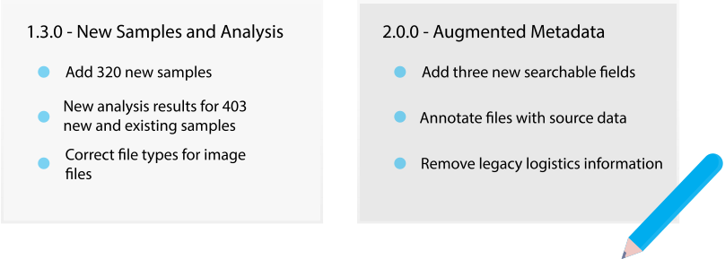

  

  
  
  
  

# Kids First Release Coordinator

The Release Coordinator assists the Data Resource Center in authoring new
data releases for the Kids First program.

  

A data release can be a complicated process in which many tasks need to be
performed so as to make new data available for search and download.

## Task Coordination

  

The Release Coordinator works with Task Services to perform work necessary to
a data release.
The coordinator will track the status of any arbitrary number of task services
throughout the lifetime of a release to ensure that all complete as expected.

## Release Versioning

  

The Release Coordinator issues a unique Kids First identifier and a Semantic
Version number for every release as soon as it is created.
This allows published and unpublished data to be tied back to a specific
release from the Data Resource Center.

## Change Log

  

Each release may include details about changes introduced by the release.
These notes may document the release as a whole, or an individual study within
the release.
