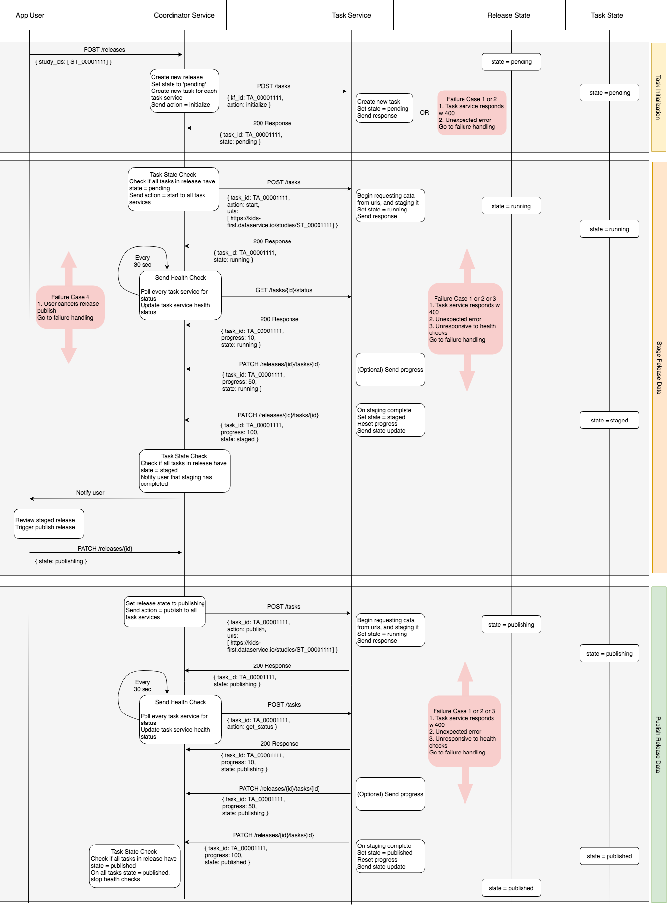
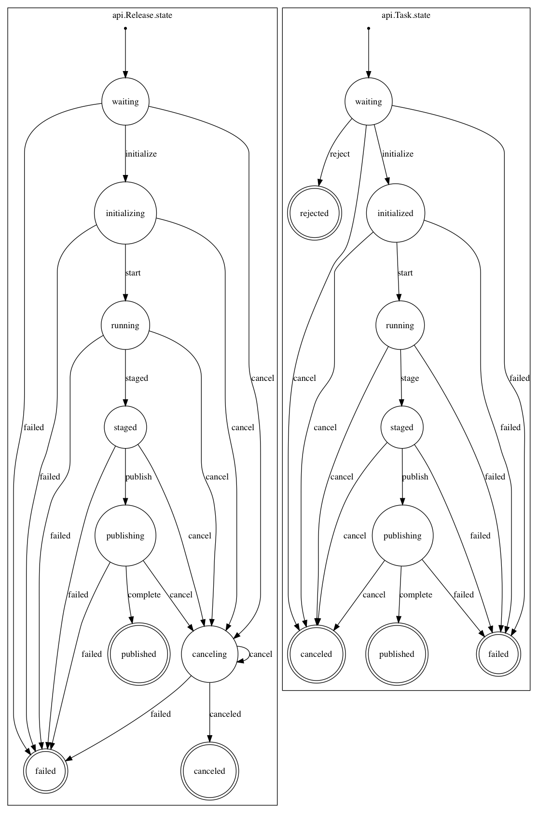
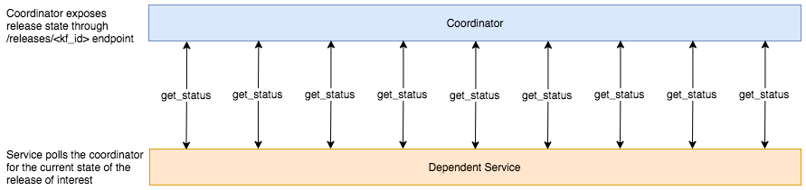
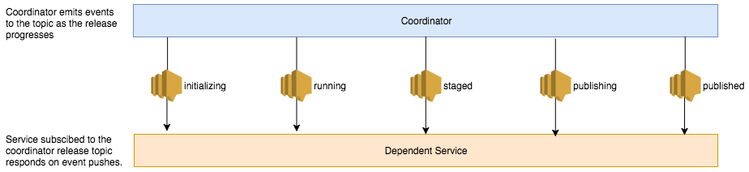

<p align="center">
  
</p>
<p align="center">
  <a href="https://github.com/kids-first/kf-api-release-coordinator/blob/master/LICENSE"></a>
  <a href="https://kids-first.github.io/kf-api-release-coordinator/docs/coordinator.html"></a>
  <a href="https://circleci.com/gh/kids-first/kf-api-release-coordinator"></a>
  <a href="https://app.codacy.com/app/kids-first/kf-api-release-coordinator/dashboard"></a>
</p>

Kids First Release Coordinator
==============================

The Kids First Release Coordinator brings different services in the Kids First ecosystem together to release data in a synchronized manner.


## Development Quick Start

If you do not already have a `kf-data-stack` docker network, create one:
```
docker network create kf-data-stack
```

Start the coordinator with docker-compose:
```
docker-compose up -d
```

This will start a number of different services and the coordinator api in development mode.
Code changes will be immediately available on the api, although any changes that affect tasks may require the `worker` container to be restarted.

The following services are started as dependencies:
- `coordinator` The Coordinator API on port `5000`
- `worker` A task worker to process different release jobs
- `redis` A redis instance to manage the work queue
- `pg` A postgres database to store information about releases, tasks, and services
- `scheduler` A simple curl that repeatedly polls the status checks


### Networking
To allow tasks to communicate with the Coordinator, they will need to be run within containers on the `kf-data-stack` network.


### Configuration

You may configure the Postgres connection settings by setting the following
env variables:

- `PG_NAME`
- `PG_USER`
- `PG_PASS`
- `PG_HOST`
- `PG_PORT`

And the Redis connection settings with:

- `REDIS_HOST`
- `REDIS_PORT`


## Background
There are several services which drive end user apps in the Kids First ecosystem. These services all consume Kids First data and must stay in sync with one and other in terms of the state of their data. One service cannot have more up to date data then another service. Additionally, there may be other services outside of the Kids First ecosystem that are interested in staying in sync with the latest Kids First data as new releases get published.

The Kids First Release Coordinator service ensures data consistency among Kids First data release consumers and is responsible for orchestrating the synchronization and publishing of a data release. Data synchronization is the process in which all data release consumers retrieve the latest release data and stage or store it in an environment/state where it is not yet accessible to the public. The publishing of a data release is the process of a data release consumer making the staged data accessible to the public.

## Coordinator and Task Services
The Kids First Release Coordinator Service consists of two types of services: The Coordinator Service and Task Services.

### Task Services
In order for a Kids First data release consumer to stay up to date with data releases, it must implement a Task Service. A task service should implement the endpoints in the Kids First Release Coordinator Task Service specification in order for the release coordinator to properly invoke tasks.

[View the spec](https://kids-first.github.io/kf-api-release-coordinator/docs/task.html)

### Coordinator Service
The task service endpoints expose a common interface for the Coordinator Service to communicate with. Through these endpoints, the Coordinator Service instructs the task services to perform a sequence of operations that carry out the steps necessary for a data release to be published.

The Release Coordinator responds to requests to release data by orchestrating
necessary tasks to execute and sync operations needed for a data release.

[View the spec](https://kids-first.github.io/kf-api-release-coordinator/docs/coordinator.html)


Task Service Operations
---------------------------------------------------
The diagram below illustrates the sequence of operations between the Coordinator service and a Task service for a
successful release publish.

Publishing a release consists of 3 steps:

1. Task initialization
    * The coordinator service will send a POST with `action=initialize` to each task service's /tasks endpoint.
    * The coordinator service will wait until all task services have responded with `state=pending` and then send the next action
2. Staging of release data
    * The coordinator will send a POST with `action=start` along with the list of retrieval urls to each task service's /tasks endpoint.
    * The task services will begin requesting release data from the given urls and staging the data. The task services will set `state=running` during this step.
    * The coordinator service will begin polling each task service for status/health via a POST with `action=get_status`. Any non-200 response will result in a failed release publish. If this happens the task service will send a POST to all task services with `action=cancel`.
    * The coordinator service will wait until all task services have responded with `state=staged` and then send the next action
3. Publishing of release data
    * Upon receiving a publish request from the user, the coordinator will send a POST with `action=publish` to each of the registered endpoints.
    * The task services will begin publishing the staged release data. The task services will set `state=publishing` during this step.
    * The coordinator service will begin polling each task service for status/health via a POST with `action=get_status`. Any non-200 response will result in a failed release publish. If this happens the task service will send a POST to all task services with `action=cancel`.
    * Once all task services have responded with `state=published`, the publish is complete.




Modes of Failure and Cancelation
---------------------------------------------------



A task or release may fail or be canceled at any stage.
The difference between the two is expected vs unexpected behavior.
Aside from this difference, the outcome of both actions should be identical.
The task or release that has been canceled or failed should result in all work to stop on the relevant release and all tasks related to it.

### Failure by rejection

The first action the coordinator requests from task services is to `initialize`.
If a task service does not respond with a `200` code, it will be assumed that it is not ready for work and the task will be set as `rejected`.
A `rejected` task will result with a `failed` release.

### Unexpected failure

A release will result in failure whenever one of its tasks reports itself as having failed, the coordinator finds the task in a `failed` state when polling for status, or when the coordinator is unable to get the status of the task from the task service.
Once one of these failures have been identified, the coordinator will attempt to cancel all tasks and result in a `failed` state.

### Cancelation by user

When a user requests a release be canceled, the coordinator will issue `cancel` actions to all tasks in the release.
The final state of the release and all tasks in it will be `canceled`

### Cancelation on failure

When the coordinator identifies one of its tasks as having failed, it will issue `cancel` actions to all other tasks in the release.
The final state of the release will be `failed` as well as the task that caused the failure.
All other tasks will end in a `canceled` state.

### Cancelation on timeout

Releases and tasks may timeout if they remain in the same state for too long.
`TASK_TIMEOUT` and `RELEASE_TIMEOUT` in the `settings.py` set these timeouts.
The coordinator will periodically poll task services for tasks that are in the release process.
If a task has been in the `waiting`, `running`, or `publishing` state longer than `TASK_TIMEOUT` allows, the release the task belongs to will be canceled.
If a release has been in the `initializing`, `running`, `publishing`, or `canceling` state for longer than `RELEASE_TIMEOUT` allows, the release will be canceled.


### Cancelation by task

Although not suggested, a task may cancel a release by reporting itself as `canceled`.


## Integrating other services with the Coordinator

The above specification outlines a service that is essential to a release.
Often, there may be services which are interested in the state of new releases, but are non-vital to its success.
Such services may be developed with far fewer contstraints than a task service.
Outlined below are two designs for services that utilize information from the coordinator about releases.

### Passive polling



The easiest way to sync with the coordinator is to poll the `/releases/<kf_id>` endpoint of the coordinator to retrieve the current state of a release.
This is sufficient for an application simply wishing for a snapshot of the current system infrequently, but will be heavy in operations for both coordinator and the service if high-resolution into state changes are needed.
Furthermore, it is easy to miss state changes if a state completes quickly and should thus not be used for any service interested in the transition events.


### Event Listener



The coordinator sends events to an SNS topic whenever a release or task changes its state.
This makes it easy for a service to react to particular changes of interest.
In addition, this ensures that communication only happens when an event occurs, resulting in less overhead.
If needed, the service should still be able to refresh its internal state from the coordinator using its API in the case that an event is missed, or the service goes offline for some time.
