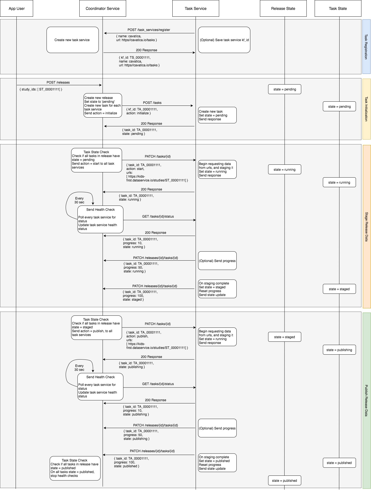

<p align="center">
  
</p>
<p align="center">
  <a href="https://github.com/kids-first/kf-api-release-coordinator/blob/master/LICENSE"></a>
  <a href="https://kids-first.github.io/kf-api-release-coordinator/docs/coordinator.html"></a>
  <a href="https://circleci.com/gh/kids-first/kf-api-release-coordinator"></a>
  <a href="https://app.codacy.com/app/kids-first/kf-api-release-coordinator/dashboard"></a>
</p>

Kids First Release Coordinator
==============================

The Kids First Release Coordinator brings different services in the Kids First ecosystem together to release data in a synchronized manner.


## Development Quick Start

Getting up and running with a fully functional Release Coordinator is as easy as:
```
git clone https://github.com/kids-first/kf-api-release-coordinator
cd kf-api-release-coordinator
docker-compose up -d
```

This will stand up a couple different services:
- The Coordinator API on port `5000`
- A task worker to process different release jobs
- A redis instance to manage the work queue
- A postgres database to store information about releases, tasks, and services

## Background
There are several services which drive end user apps in the Kids First ecosystem. These services all consume Kids First data and must stay in sync with one and other in terms of the state of their data. One service cannot have more up to date data then another service. Additionally, there may be other services outside of the Kids First ecosystem that are interested in staying in sync with the latest Kids First data as new releases get published.

The Kids First Release Coordinator service ensures data consistency among Kids First data release consumers and is responsible for orchestrating the synchronization and publishing of a data release. Data synchronization is the process in which all data release consumers retrieve the latest release data and stage or store it in an environment/state where it is not yet accessible to the public. The publishing of a data release is the process of a data release consumer making the staged data accessible to the public.

## Coordinator and Task Services
The Kids First Release Coordinator Service consists of two types of services: The Coordinator Service and Task Services.

### Task Services
In order for a Kids First data release consumer to stay up to date with data releases, it must implement a Task Service. A task service should implement the endpoints in the Kids First Release Coordinator Task Service specification in order for the release coordinator to properly invoke tasks.

[View the spec](https://kids-first.github.io/kf-api-release-coordinator/docs/task.html)

### Coordinator Service
The task service endpoints expose a common interface for the Coordinator Service to communicate with. Through these endpoints, the Coordinator Service instructs the task services to perform a sequence of operations that carry out the steps necessary for a data release to be published.

The Release Coordinator responds to requests to release data by orchestrating
necessary tasks to execute and sync operations needed for a data release.

[View the spec](https://kids-first.github.io/kf-api-release-coordinator/docs/coordinator.html)


Sequence of Operations (Success Case)
---------------------------------------------------
The diagram below illustrates the sequence of operations between the Coordinator service and a Task service for a
successful release publish.

Publishing a release consists of 3 steps:

1. Task initialization
    * The coordinator service will send a POST with `action=initialize` to each task service's /tasks endpoint.
    * The coordinator service will wait until all task services have responded with `state=pending` and then send the next action
2. Staging of release data
    * The coordinator will send a POST with `action=start` along with the list of retrieval urls to each task service's /tasks endpoint.
    * The task services will begin requesting release data from the given urls and staging the data. The task services will set `state=running` during this step.
    * The coordinator service will begin polling each task service for status/health via a POST with `action=get_status`. Any non-200 response will result in a failed release publish. If this happens the task service will send a POST to all task services with `action=cancel`.
    * The coordinator service will wait until all task services have responded with `state=staged` and then send the next action
3. Publishing of release data
    * Upon receiving a publish request from the user, the coordinator will send a POST with `action=publish` to each of the registered endpoints.
    * The task services will begin publishing the staged release data. The task services will set `state=publishing` during this step.
    * The coordinator service will begin polling each task service for status/health via a POST with `action=get_status`. Any non-200 response will result in a failed release publish. If this happens the task service will send a POST to all task services with `action=cancel`.
    * Once all task services have responded with `state=published`, the publish is complete.



Sequence of Operations (Failure Case 1)
---------------------------------------------------
The diagram below illustrates the sequence of operations between the Coordinator service and a Task service for an example
failed release publish.
TODO
