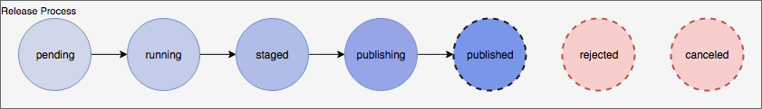
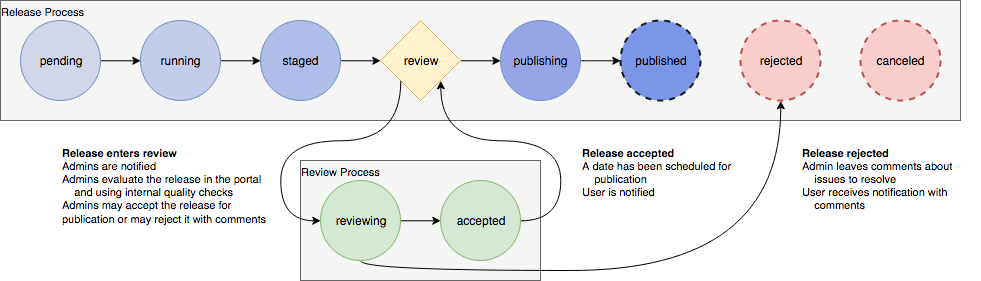

# Review Process

## Motivation

With the desire to hold quality to a high standard in the  Kids First
Data Resource Portal, a review process is likely to be a huge benefit.
Implementing a review process will insure that data intended to be released
to the portal will be scrutinized before ever becoming public and establish
a channel to communicate issues with the data contributors.

## Implementation

The current release process state diagram is shown below:

This is a linear process that, while allowing a release to be canceled at
any time, does not explicitly require review or approval of the release.

Here, two new states, `reviewing` and `accepted`, are introduced to the release
state flow. 

After a release has been `staged`, it immediately enters the `reviewing`
state. During this transition, data administrators are notified for review via
slack and email. 

During the `reviewing` state, administrators will evaluate the quality of the
release by inspecting it within a privatized portal and using any other quality
tools that have been created for the purpose of evaluting a release.
After evaluting a release, an administrator will either approve or reject
a release.  If the release is approved, it moves to the `accepted` state
where it will remain until it is moved to `publishing`, either immediately
or on some schedule.
If the release is `rejected` by the administrator, the administrator will be
allowed to provide comments on the release which will be returned to the
submitter of the release.

When a release is `rejected` or `accepted`, the submitter of the release
should be notified via slack and email.

## Optional Features

### Signoff Conditions

The logic of when a release may move to the `accepted` state could take a 
couple different forms:

 - A minimum number of administrators must approve of a release
 - All administrators must approve of a release
 - Some subset of administrators are assigned to review on creation of release

### Release Scheduling

A release would likely progress from `accepted` to `publishing` immediately 
or on a daily cron in the naieve case. Optionally, the ability to specify a
date for the release to be published could be set during the approval process.

## Open Questions

This process is oriented towards users submitting release for a subset of
studies. How do full portal releases work?
